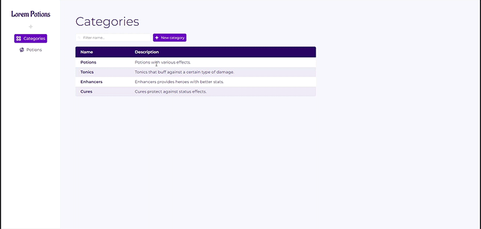
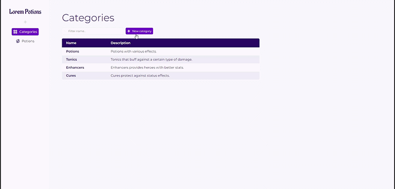
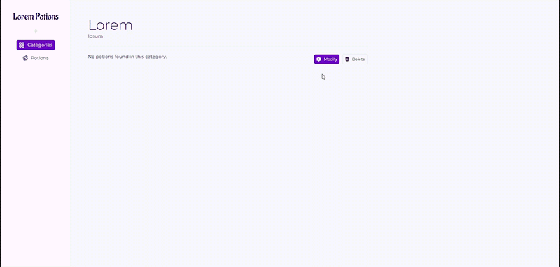
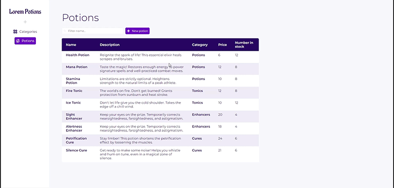
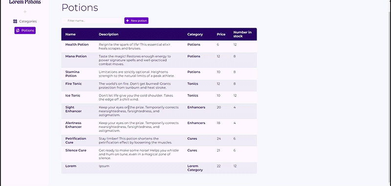

▶️ [Demo](https://lorem-potions.fly.dev/categories)

## 📄 Description
Une application CRUD de gestion d'inventaire réalisée dans le cadre de l'[Odin Project](https://www.theodinproject.com/lessons/nodejs-inventory-application). Les descriptions des potions, ainsi que leurs noms et ceux des catégories sont tirés du jeu *Potionomics*. L'application a été codée en Express. Elle utilise MongoDB pour ses bases de données (couplé à Mongoose) ce qui rend chaque modifications par l'administrateur durables. 

- L'application est hébergée sur Fly.io, où le mot de passe administrateur est stocké via une variable ENV (appelés *secrets* par Fly.io). 

- L'utilisateur peut voir les catégories et les potions de la boutique. 
- De la page index et détails de chaque élément, il peut accéder aux objets qui lui sont relatifs.
- Il peut filtrer les catégories aussi bien que les potions via une barre de recherche.

- Il peut créer une nouvelle catégorie ou une nouvelle potion à condition de détenir le mot de passe administrateur.

- Il peut également modifier ou supprimer un élement de l'inventaire à conditions de détenir le mot de passe administrateur.

- Lorsqu'il crée ou modifie un élement dans l'inventaire, les inputs de l'utilisateur sont validés et *sanitized* par Express-Validator.
- En cas d'erreur, l'utilisateur reçoit le détail des modifications à apporter pour que sa soumission soit valide.

- L'utilisateur ne peut pas supprimer une catégorie si elle contient encore une potion. En revanche, il peut supprimer les potions à loisirs.

## 🔨 Outils utilisés
- NodeJS
- Express
- MongoDB
- Mongoose
- EJS
- CSS